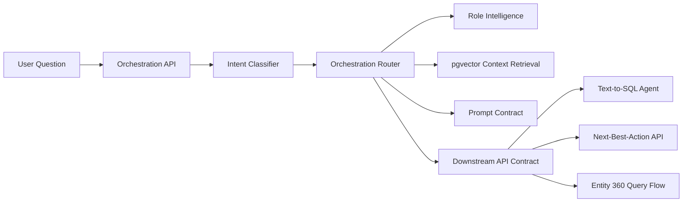

# Insurance Copilot Orchestration Layer

This service classifies a user question, selects the retrieval strategy, builds the prompt contract, and returns the downstream API contract needed to answer the question. It sits above the role intelligence, pgvector context retrieval, text-to-SQL, and next-best-action services.

## Intent Classes

- `ANALYTICS`: aggregated analysis, comparisons, trends, explorations.
- `RECOMMENDATION`: who to call, what to do next, next-best-action queues.
- `EXPLANATION`: why a score, action, risk, or result occurred.
- `KPI_LOOKUP`: governed KPI definition or current KPI value.
- `CUSTOMER_360`: customer profile and relationship summary.
- `AGENT_360`: agent profile, productivity, performance, and coaching summary.
- `CAMPAIGN_360`: campaign funnel, attribution, conversion, and follow-up summary.
- `CLAIMS_360`: claim profile, severity, fraud indicators, and review summary.

## Architecture



## Files

- `copilot_orchestration/models.py`: Pydantic contracts and enums.
- `copilot_orchestration/intents.py`: intent definitions, context sources, tables, models, SQL and explanation requirements.
- `copilot_orchestration/classifier.py`: deterministic intent classifier.
- `copilot_orchestration/retrieval.py`: retrieval strategy builder and pgvector/role-context integration.
- `copilot_orchestration/prompts.py`: prompt templates and output contracts.
- `copilot_orchestration/router.py`: orchestration plan builder.
- `copilot_orchestration/api.py`: FastAPI service.
- `tests/test_copilot_orchestration.py`: classifier/router tests.

## Run Locally

```powershell
cd C:\Users\Nitin\Documents\Codex\2026-05-29\act-as-an-enterprise-insurance-data
.\.venv\Scripts\Activate.ps1
uvicorn copilot_orchestration.api:app --reload --port 8030
```

Swagger:

```text
http://127.0.0.1:8030/docs
```

## API Contracts

### Classify Intent

```http
POST /classify-intent
Content-Type: application/json

{
  "question": "Which customers should I call this week?"
}
```

Response:

```json
{
  "intent": "RECOMMENDATION",
  "confidence_score": 0.88,
  "rationale": "Question asks for prioritized operational action.",
  "matched_signals": ["which customers should", "call this week"],
  "fallback_intent": "ANALYTICS"
}
```

### Orchestrate

```http
POST /orchestrate
Content-Type: application/json

{
  "question": "What is our current lapse rate?",
  "role_code": "executive_leadership",
  "include_context": true,
  "execute": false
}
```

Response sections:

- `classification`: intent and confidence.
- `intent_definition`: context sources, required tables, models, SQL requirements, explanation requirements.
- `retrieval_plan`: pgvector strategy and data retrieval flags.
- `prompt_contract`: system prompt, user prompt template, required inputs, output contract.
- `api_contract`: downstream service route and request/response shape.
- `retrieved_context`: pgvector context when `include_context=true`.
- `role_profile`: role profile when `role_code` is supplied and context retrieval is enabled.

## Retrieval Strategy

The router builds a semantic query from:

- Original user question
- Classified intent
- Required tables
- Required ML models
- Role code

Then it retrieves from `semantic_documents` using hybrid pgvector search. For role-aware requests, it also pulls `v_role_intelligence_profile`.

## Example Routing

| Question | Intent | Route |
|---|---|---|
| Which campaigns performed best? | `CAMPAIGN_360` | Entity 360/Text-to-SQL |
| Which customers should I call this week? | `RECOMMENDATION` | Next-best-action |
| Why is this customer at high lapse risk? | `EXPLANATION` | Model explanation/Text-to-SQL |
| Show me policies sold in Singapore. | `ANALYTICS` | Text-to-SQL |
| What is our current lapse rate? | `KPI_LOOKUP` | KPI/Text-to-SQL |

## Test

```powershell
python -m pytest tests/test_copilot_orchestration.py
```

