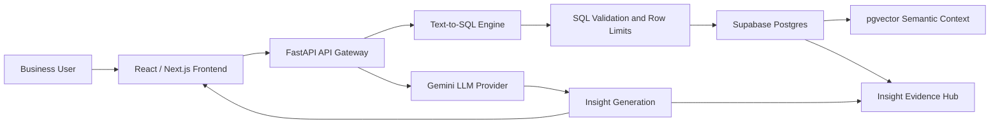

# Solution Overview

## Business Problem

Insurance teams often work across separate systems for customer records, policies, campaigns, claims, agent productivity, and model outputs. Business users need quicker answers to questions such as:

- Which customers are at risk of lapse?
- Which agents need coaching?
- Which campaigns converted best?
- Which product should be recommended next?
- Why did the AI recommend this action?

The platform addresses this by unifying synthetic insurance data, analytical features, ML scores, semantic context, and GenAI-driven insights.

## Solution Concept

The Insurance Decision Intelligence Platform is an AI-enabled analytics layer that supports dashboards, entity 360 views, natural language questions, SQL-backed insight generation, and evidence traceability.

## User Personas

| Persona | Primary Objective | Supported By |
|---|---|---|
| Insurance Agent | Prioritize customers and next actions | Know Your Customer, AI Intelligence, next best actions |
| Agency Manager | Improve agent productivity and coaching | Know Your Agent, Agent Performance Tracking |
| Campaign Manager | Improve campaign conversion and ROI | Campaign Effectiveness |
| Claims Manager | Understand claims and fraud indicators | Claims 360 API, claims subject area |
| Sales Director | Track distribution growth and productivity | Home, Agent Performance Tracking |
| Executive Leadership | Understand risks, growth opportunities, and revenue impact | Home, AI Intelligence |
| Data Analyst | Inspect SQL, lineage, tables, context, and model evidence | AI Intelligence, Insight Evidence Hub |

## Data Products

| Data Product | Status | Frontend / API Evidence |
|---|---:|---|
| Home executive view | Implemented | `HomeView` in `frontend/app/page.tsx` |
| Know Your Customer | Implemented | `CustomerView`, `GET /customers/search`, `GET /customers/{id}/360` |
| Know Your Agent | Implemented | `AgentView`, `GET /agents/search`, `GET /agents/{id}/360` |
| Campaign Effectiveness | Implemented | `CampaignView`, `GET /campaigns/search`, `GET /campaigns/{id}/360` |
| Agent Performance Tracking | Implemented | `AgentPerformanceView`, `GET /agents/performance-dashboard` |
| Policy Lapse Risk | Implemented | `LapseRiskView`, `GET /policies/lapse-dashboard` |
| AI Intelligence | Partially implemented | `AiInsightV10View`, `POST /ai-insight-v11/ask` |
| Insight Evidence Hub | Implemented for saved AI insight snapshots | `InsightEvidenceHubView`, `GET /debug/latest-insight-evidence` |

## High-Level Architecture

## End-To-End User Journey

1. User selects a role and asks a business question.
2. Frontend calls the API gateway.
3. Backend classifies the intent and retrieves relevant context.
4. SQL is generated through Gemini or fallback templates.
5. SQL safety validates read-only behavior.
6. SQL executes against Supabase Postgres.
7. Results are interpreted into business-readable insights.
8. Evidence is saved for traceability.
9. User reviews answer, SQL, result preview, context, limitations, and model evidence.

## Implementation Notes

| Component | Status | Reference |
|---|---:|---|
| Frontend API base configuration | Implemented | `frontend/.env.local`, `frontend/app/page.tsx` |
| API Gateway | Implemented | `copilot_api_gateway/api.py` |
| SQL engine | Implemented | `copilot_sql_engine/` |
| Context retrieval | Implemented | `context_retriever_service.py`, `embedding_pipeline/db.py` |
| Role layer | Implemented | `023_role_based_intelligence_layer.sql`, `role_intelligence_service.py` |
| Evidence snapshots | Implemented | `027_insight_test_snapshots.sql`, `insight_snapshot_service.py` |
| Production authentication | Not found in current codebase | Recommended before production |

