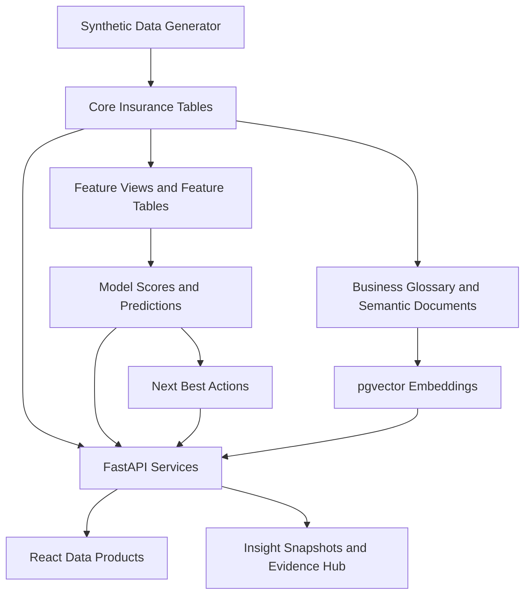
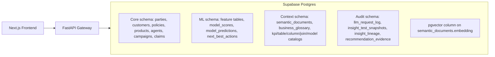
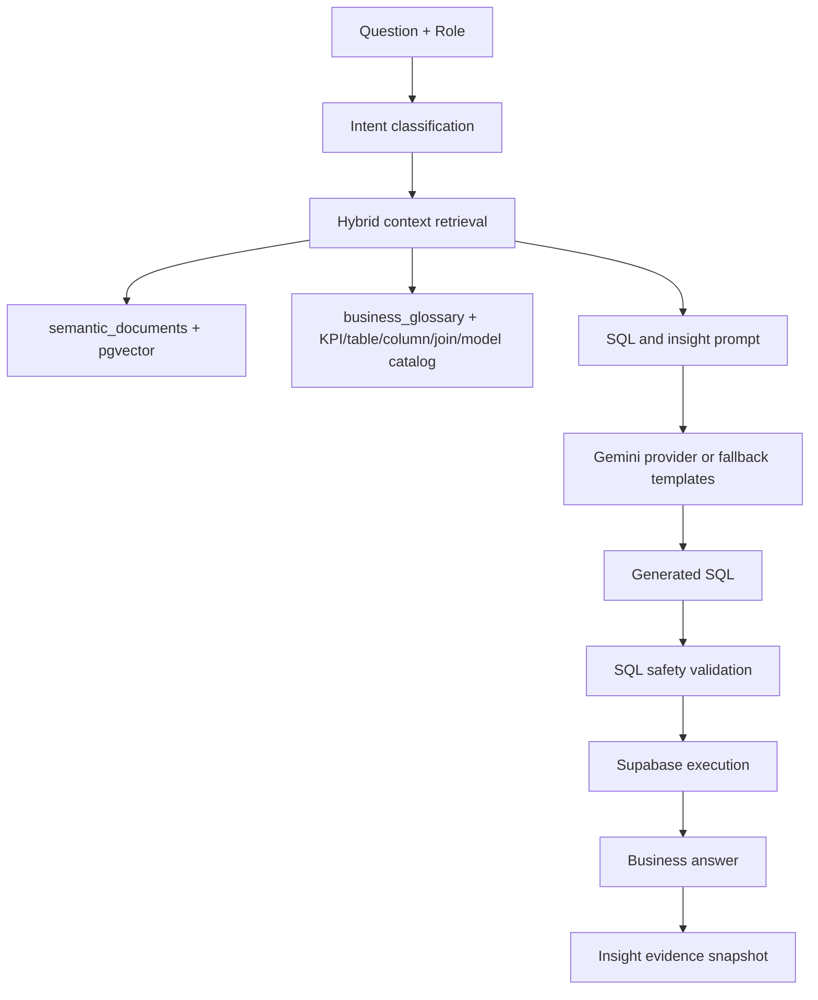
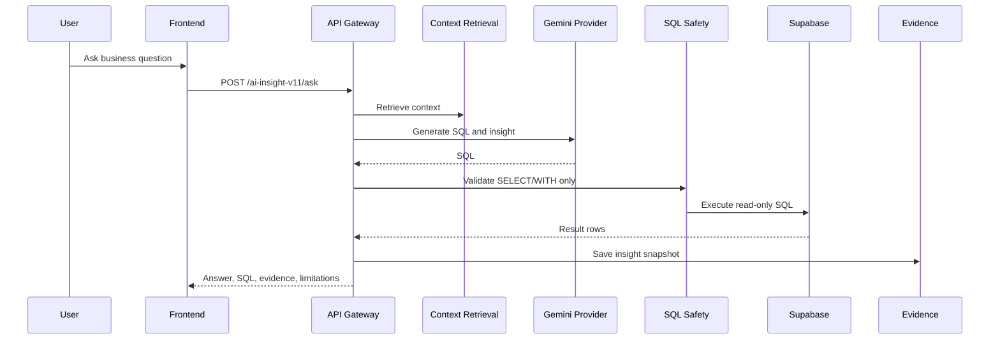

# Data Architecture

## Architecture Layers

| Layer | Description | Status | Evidence |
|---|---|---:|---|
| Synthetic generation | Creates 3-year insurance CSV-style synthetic data with customers, policies, agents, campaigns, claims, events, ML labels. | Implemented | `generate_synthetic_insurance_data.py` |
| Raw / staging | Dedicated raw/staging schema or landing tables. | Not found in current codebase | CSV output and direct load scripts are used instead. |
| Core insurance operational layer | Normalized insurance entities. | Implemented | `001_insurance_analytics_mvp_schema.sql` |
| ML enhancement layer | Behavior, policy events, agent activity, claims indicators, model scores, next actions. | Implemented | `005_ml_schema_enhancements.sql` |
| Feature layer | Leakage-safe model feature views and physical tables. | Implemented | `006_ml_feature_engineering_views.sql`, `007_ml_feature_tables.sql` |
| Scoring layer | Model artifacts, scoring jobs, latest score view. | Implemented | `014_ml_scoring_serving_schema.sql`, `ml_scoring_pipeline.py` |
| Next best action layer | SQL and Python decisioning. | Implemented | `016_next_best_action_engine.sql`, `020_genai_next_best_action_decisioning.sql`, `nba_engine/` |
| Semantic context layer | Semantic documents, glossary, vector search, catalog tables. | Implemented | `017_genai_context_layer_pgvector.sql`, `028_ai_insight_rag_quality_layer.sql` |
| LLM / RAG layer | Context retrieval, SQL generation, validation, insight generation. | Implemented / Partially implemented | `copilot_sql_engine/`, `ai_insight_v11_service.py` |
| Presentation layer | Next.js dashboard and data product tabs. | Implemented | `frontend/app/page.tsx` |
| Evidence and audit | Insight snapshots, lineage, request log, recommendation evidence. | Implemented / Partially populated | `024_explainability_governance_framework.sql`, `025_llm_request_log.sql`, `027_insight_test_snapshots.sql` |

## Logical Data Architecture

## Physical Data Architecture

## AI / RAG Architecture

## Text-to-SQL Architecture

## Key Database Areas

| Area | Implemented Tables / Views | Planned / Recommended or Not Found |
|---|---|---|
| Customer | `customers`, `parties`, `addresses`, `customer_behavior_daily`, `customer_digital_events`, `customer_complaints`, `customer_nps`, `customer_service_requests`, `customer_satisfaction_surveys` | `households` not found |
| Policy | `policies`, `policy_coverages`, `policy_events`, `policy_renewals`, `policy_lapse_events`, `premiums`, `payments` | Production policy administration integration not found |
| Agent | `agents`, `agent_movements`, `agent_mapa_metrics`, `agent_calls`, `agent_meetings`, `agent_targets`, `agent_commissions`, `agent_training`, `agent_attrition_events` | Real agency hierarchy integration not found |
| Campaign | `campaigns`, `campaign_targets`, `campaign_responses`, `leads`, `opportunities` | Real marketing automation integration not found |
| Claims | `claims`, `claim_parties`, `claim_assessments`, `claim_fraud_indicators` | Claims adjudication integration not found |
| ML | `model_features`, `model_scores`, `model_predictions`, `model_artifacts`, `model_scoring_jobs`, `next_best_actions`, `ml_training_labels` | Production model registry and monitoring partially implemented |
| Context | `semantic_documents`, `business_glossary`, `kpi_definitions`, `table_catalog`, `column_catalog`, `join_path_catalog`, `model_catalog`, `insight_templates`, `missing_data_rules` | Runtime enrichment governance planned |
| Evidence | `insight_test_snapshots`, `llm_request_log`, `insight_lineage`, `recommendation_evidence`, `model_explanations`, `context_usage_log` | Broad UI for all evidence tables partially implemented |

## Important Gaps

| Gap | Status | Business Impact | Recommendation |
|---|---:|---|---|
| Dedicated raw/staging schema | Not found | Harder production ingestion traceability | Add landing/staging schemas and ELT jobs. |
| Households | Not found | Household-level relationship analytics unavailable | Add household/account grouping if required by client. |
| Production scheduling | Not found | Manual refresh risk | Add scheduled jobs for feature refresh, scoring, embedding, evidence retention. |
| Production access control | Not found | Not suitable for real customer data | Add authentication, authorization, RLS, and secrets governance. |

