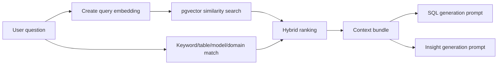

# Context Layer And pgvector

## Purpose

The context layer gives the LLM business, schema, KPI, join, and model context before generating SQL or explanations. It is intended to reduce hallucination and make answers more grounded in the insurance data model.

## Implemented Context Objects

| Object | Status | Evidence |
|---|---:|---|
| `semantic_documents` | Implemented | `001_insurance_analytics_mvp_schema.sql`, enhanced in `017_genai_context_layer_pgvector.sql` |
| `business_glossary` | Implemented | `001_insurance_analytics_mvp_schema.sql` |
| `kpi_definitions` | Implemented | `028_ai_insight_rag_quality_layer.sql` |
| `table_catalog` | Implemented | `028_ai_insight_rag_quality_layer.sql` |
| `column_catalog` | Implemented | `028_ai_insight_rag_quality_layer.sql` |
| `join_path_catalog` | Implemented | `028_ai_insight_rag_quality_layer.sql` |
| `model_catalog` | Implemented | `028_ai_insight_rag_quality_layer.sql` |
| `insight_templates` | Implemented | `028_ai_insight_rag_quality_layer.sql` |
| `missing_data_rules` | Implemented | `028_ai_insight_rag_quality_layer.sql` |

## What Semantic Documents Contain

Semantic documents are designed to include:

- Business glossary entries.
- KPI definitions.
- Table and column descriptions.
- Join path explanations.
- Metric calculation rules.
- Sample business questions.
- Sample SQL templates.
- Policy, agent, campaign, customer, claims, and next-best-action context.

Enhancements are implemented in `017_genai_context_layer_pgvector.sql`, and seed context is in `018_seed_insurance_copilot_context_documents.sql` and `029_seed_ai_insight_context_catalog.sql`.

## Why pgvector Is Used

pgvector enables semantic retrieval inside Supabase Postgres. Instead of relying only on exact keyword matching, the platform can retrieve business context that is semantically related to a user question.

Example:

Question: "Which customers are likely to lapse?"

Retrieved context can include:

- Policy lapse context.
- Lapse KPI definition.
- Customer-policy-payment joins.
- Policy lapse model definition.
- Missing data warnings if a required signal is absent.

## Embedding Pipeline

| Capability | Status | Evidence |
|---|---:|---|
| Read semantic documents without embeddings | Implemented | `embedding_pipeline/db.py` |
| Provider abstraction | Implemented | `embedding_pipeline/providers.py` |
| Gemini embeddings | Implemented | `GeminiEmbeddingProvider` |
| OpenAI embeddings | Implemented | `OpenAIEmbeddingProvider` |
| OpenAI-compatible embeddings | Implemented | `CompatibleHttpEmbeddingProvider` |
| Ollama embeddings | Implemented | `OllamaEmbeddingProvider` |
| Local sentence-transformers | Implemented | `LocalSentenceTransformerProvider` |
| Store vectors in Supabase | Implemented | `update_embeddings` in `embedding_pipeline/db.py` |
| Similarity search | Implemented | `match_semantic_documents` in `017_genai_context_layer_pgvector.sql` and `019_use_ollama_embeddings_768.sql` |

## Retrieval Flow



## Context Bundle Structure

The retrieval service returns a structured bundle similar to:

```json
{
  "business_context": [],
  "schema_context": [],
  "metric_context": [],
  "model_context": [],
  "sql_examples": []
}
```

This is implemented in `context_retriever_service.py` through `bundle_context`.

## Question Type Mapping

| Question Type | Retrieved Context | Tables Needed | Models Needed | SQL Support |
|---|---|---|---|---|
| Which customers are likely to lapse? | Policy lapse, retention KPI, customer/policy/payment joins | `customers`, `policies`, `payments`, `model_scores` | `policy_lapse` | Customer-policy-payment join, score filter |
| Which agents need coaching? | MAPA, agent performance, target achievement | `agents`, `agent_mapa_metrics`, `agent_targets`, `model_scores` | `agent_performance`, `agent_attrition` | Agent activity and target joins |
| Which campaigns converted best? | Campaign conversion, funnel metric definitions | `campaigns`, `campaign_targets`, `campaign_responses`, `leads`, `opportunities`, `policies` | `campaign_response` | Campaign funnel aggregation |
| Which product should be cross-sold? | Next best product, product gap, propensity definitions | `customers`, `policies`, `products`, `model_predictions`, `model_scores` | `next_best_product`, `propensity_to_buy` | Product holding gap query |
| Why did AI recommend this action? | Next best action, evidence, model catalog, context usage | `next_best_actions`, `model_scores`, `recommendation_evidence`, `context_usage_log` | Relevant recommendation models | Evidence and lineage joins |

## Missing Data Handling

`028_ai_insight_rag_quality_layer.sql` defines `missing_data_rules`, and `ai_insight_v11_service.py` includes functions such as `infer_missing_data`, `infer_context_limitations`, and `infer_model_limitations`.

The intended behavior is:

- Do not pretend unavailable data exists.
- Mark gaps as limitations.
- Separate business limitations from technical warnings.
- Lower confidence when result support is weak.

