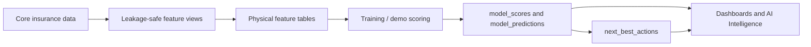

# ML Models And Feature Mapping

## Model Inventory

| Model | Status | Feature Table | Output Tables | Used By |
|---|---:|---|---|---|
| Propensity to Buy | Implemented as feature/scoring pattern | `propensity_to_buy_features` | `model_scores`, `model_predictions` | KYC, AI Intelligence, next best action |
| Next Best Product | Implemented as feature table and prediction concept | `next_best_product_features` | `model_predictions`, `next_best_actions` | KYC, AI Intelligence |
| Customer Churn | Implemented as feature/scoring pattern | `customer_churn_features` | `model_scores` | KYC, AI Intelligence |
| Policy Lapse Risk | Implemented as feature/scoring/dashboard pattern | `policy_lapse_features` | `model_scores`, `next_best_actions` | Policy Lapse Risk |
| Agent Performance | Implemented | `agent_performance_features` | `model_scores` | Agent Performance Tracking |
| Next Best Customer / Next Best Action | Implemented | `next_best_customer_features` plus NBA SQL/Python rules | `next_best_actions` | Agent Performance, KYC, AI |
| Lead Conversion | Implemented as feature/scoring pattern | `lead_conversion_features` | `model_scores` | Campaign Effectiveness |
| Agent Attrition | Implemented as feature/scoring pattern | `agent_attrition_features` | `model_scores` | Agent Performance Tracking |
| Claim Occurrence | Implemented as feature/scoring pattern | `claim_prediction_features` | `model_scores` | Claims architecture |
| Fraud Risk | Implemented as feature/scoring pattern | `fraud_detection_features` | `model_scores` | Claims architecture |
| Customer Lifetime Value | Implemented as feature/scoring pattern | `customer_lifetime_value_features` | `model_scores` | KYC, next best action |
| Campaign Response | Implemented as feature/scoring pattern | `campaign_response_features` | `model_scores` | Campaign Effectiveness |

## Implementation Evidence

- Feature views: `006_ml_feature_engineering_views.sql`
- Physical feature tables: `007_ml_feature_tables.sql`
- Refresh script: `009_refresh_ml_feature_tables.sql`
- Chunk refresh helpers: `012_ml_feature_chunk_refresh_helpers.sql`
- Feature orchestration and checks: `refresh_ml_feature_tables.py`
- Model serving schema: `014_ml_scoring_serving_schema.sql`
- Scoring pipeline: `ml_scoring_pipeline.py`
- Next best action SQL: `016_next_best_action_engine.sql`, `020_genai_next_best_action_decisioning.sql`
- Python NBA engine: `nba_engine/`

## Feature And Target Design

Each feature table includes the common pattern:

- `entity_id`
- `snapshot_date`
- model-specific features
- `target_label`
- `training_window_start`
- `training_window_end`
- `prediction_window_start`
- `prediction_window_end`

Leakage prevention is implemented by calculating features from data before `snapshot_date` and labels from future outcome windows.

## Model Detail

### 1. Propensity To Buy

| Attribute | Detail |
|---|---|
| Business purpose | Predict customers likely to buy or cross-sell. |
| Target entity | Customer |
| Prediction type | Probability / binary label |
| Target label | `propensity_to_buy_label` or future purchase activity |
| Feature table | `propensity_to_buy_features` |
| Output | `model_scores`, `model_predictions`, `next_best_actions` |
| Score interpretation | Higher score means stronger buying propensity. |
| Used by tabs | KYC, AI Intelligence, Home |
| Example recommendation | "Prioritize health cross-sell call." |
| Limitation | Demo-oriented features and synthetic labels; production model validation not found. |

### 2. Next Best Product

| Attribute | Detail |
|---|---|
| Business purpose | Recommend product candidates based on current holdings, behavior, and customer segment. |
| Target entity | Customer-product candidate |
| Feature table | `next_best_product_features` |
| Output | `model_predictions`, `next_best_actions` |
| Used by tabs | KYC, AI Intelligence |
| Limitation | Feature table exists; production recommender evaluation not found. |

### 3. Customer Churn

| Attribute | Detail |
|---|---|
| Business purpose | Identify customers likely to disengage or leave. |
| Target entity | Customer |
| Feature table | `customer_churn_features` |
| Key signals | Complaints, engagement decline, service issues, policy activity. |
| Used by tabs | KYC, AI Intelligence |

### 4. Policy Lapse Risk

| Attribute | Detail |
|---|---|
| Business purpose | Identify policies likely to lapse and premium at risk. |
| Target entity | Policy |
| Feature table | `policy_lapse_features` |
| Key signals | Missed payments, premium increase, complaint count, renewal date, engagement, agent contact gap. |
| Output | `model_scores`, `next_best_actions` |
| Used by tabs | Policy Lapse Risk, KYC, AI Intelligence |

### 5. Agent Performance

| Attribute | Detail |
|---|---|
| Business purpose | Predict and explain agent productivity and coaching needs. |
| Target entity | Agent |
| Feature table | `agent_performance_features` |
| Key signals | MAPA activity, policies sold, premium, conversion, persistency, target attainment. |
| Used by tabs | Know Your Agent, Agent Performance Tracking |

### 6. Next Best Customer / Next Best Action

| Attribute | Detail |
|---|---|
| Business purpose | Recommend who an agent or manager should act on next. |
| Target entity | Customer-agent/action |
| Feature table | `next_best_customer_features` |
| Output | `next_best_actions` |
| Business rules | Implemented in `016_next_best_action_engine.sql`, `020_genai_next_best_action_decisioning.sql`, and `nba_engine/rules.py`. |
| Used by tabs | KYC, KYA, AI Intelligence |

### 7. Lead Conversion

| Attribute | Detail |
|---|---|
| Business purpose | Predict which leads will convert to quotes or policies. |
| Target entity | Lead |
| Feature table | `lead_conversion_features` |
| Used by tabs | Campaign Effectiveness |

### 8. Agent Attrition

| Attribute | Detail |
|---|---|
| Business purpose | Identify agents at risk of leaving or becoming inactive. |
| Target entity | Agent |
| Feature table | `agent_attrition_features` |
| Key signals | Declining commission, activity decline, target misses, movement history. |

### 9. Claim Occurrence

| Attribute | Detail |
|---|---|
| Business purpose | Predict claim likelihood. |
| Target entity | Customer, policy, or claim-risk unit |
| Feature table | `claim_prediction_features` |
| Used by tabs | Claims architecture; no dedicated frontend Claims tab found in current main navigation. |

### 10. Fraud Risk

| Attribute | Detail |
|---|---|
| Business purpose | Identify potentially suspicious claims. |
| Target entity | Claim |
| Feature table | `fraud_detection_features` |
| Key signals | `claim_fraud_indicators`, claim assessment data. |

### 11. Customer Lifetime Value

| Attribute | Detail |
|---|---|
| Business purpose | Estimate future customer value adjusted by retention likelihood. |
| Target entity | Customer |
| Feature table | `customer_lifetime_value_features` |
| Used by tabs | KYC, AI Intelligence, next best action prioritization |

### 12. Campaign Response

| Attribute | Detail |
|---|---|
| Business purpose | Predict response/conversion likelihood for campaigns. |
| Target entity | Campaign target or customer |
| Feature table | `campaign_response_features` |
| Key signals | Targeting, opens, clicks, response, lead and policy conversion. |
| Used by tabs | Campaign Effectiveness |

## Feature Mapping Examples

| Model | Entity | Feature | Source Table | Transformation | Business Meaning |
|---|---|---|---|---|---|
| Policy Lapse Risk | Policy | Missed payment count | `payments` | Count failed/past-due payments before snapshot | Payment friction increases lapse risk |
| Policy Lapse Risk | Policy | Premium increase flag | `policy_events` | Detect premium increase event | Price shock can increase lapse |
| Policy Lapse Risk | Policy | Complaint count | `customer_complaints` | Count unresolved complaints | Service dissatisfaction increases risk |
| Agent Performance | Agent | Meetings count | `agent_mapa_metrics` | Monthly sum | Activity level |
| Agent Performance | Agent | Proposals count | `agent_mapa_metrics` | Monthly sum | Pipeline creation |
| Agent Performance | Agent | Conversion rate | `agent_mapa_metrics`, `policies` | Policies bound / quotes or applications | Sales effectiveness |
| Campaign Response | Campaign target | Open rate | `campaign_responses` | Opens / delivered | Engagement |
| Campaign Response | Campaign target | Policy conversion | `policies`, `opportunities` | Policies issued from campaign | Campaign business impact |
| CLV | Customer | Annual premium | `policies` | Sum active annual premium | Current value base |
| Fraud Risk | Claim | Fraud indicator count | `claim_fraud_indicators` | Count active indicators | Suspicion score signal |

## Model Flow

## Important Model Limitations

| Limitation | Status | Recommendation |
|---|---:|---|
| Synthetic labels | Implemented but synthetic | Replace with historical outcomes for production. |
| Production model validation | Not found | Add validation metrics, model cards, challenger monitoring. |
| Real SHAP output | Partially implemented conceptually | Add SHAP or feature contribution persistence per score. |
| Automated model retraining | Not found | Add MLOps pipeline and registry workflow. |

