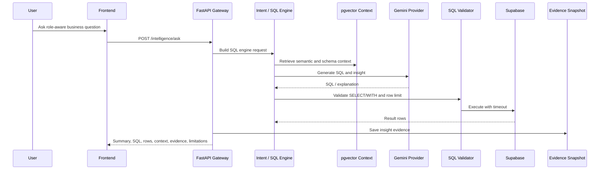

# AI Intelligence Architecture

## Purpose

AI Intelligence lets users ask natural language insurance business questions and receive SQL-backed, model-aware, context-aware, evidence-backed answers.

The main implemented API is `POST /intelligence/ask` in `copilot_api_gateway/api.py`, backed by `ai_insight_v11_service.py` and `copilot_sql_engine/`. The legacy alias `POST /ai-insight-v11/ask` remains available for compatibility.

## Implemented Response Structure

`AiInsightV11Response` in `frontend/app/page.tsx` includes:

- `answer_summary`
- `key_data_points`
- `insights`
- `recommendations`
- `generated_sql`
- `sql_validation_status`
- `sql_execution_status`
- `row_count`
- `result_preview`
- `related_tables`
- `related_columns`
- `related_context`
- `models_used`
- `business_data_limitations`
- `context_limitations`
- `model_limitations`
- `technical_warnings`
- `fallback_used`
- `gemini_available`
- `gemini_quota_exhausted`
- `confidence_score`
- `latency_ms`
- `provider_used`
- `model_used`

## End-To-End Flow

## AI Components

| Component | Status | Evidence |
|---|---:|---|
| Role-aware request | Implemented | `role` in AI view and service payloads |
| Intent classification | Implemented | `copilot_orchestration/classifier.py`, `POST /intent/classify` |
| Context retrieval | Implemented | `context_retriever_service.py`, `copilot_sql_engine/engine.py` |
| Text-to-SQL generation | Implemented | `copilot_sql_engine/generator.py`, `copilot_sql_engine/llm_providers.py` |
| SQL validation | Implemented | `copilot_sql_engine/safety.py` |
| SQL execution | Implemented | `copilot_sql_engine/executor.py` |
| LLM result validation | Partially implemented | `validate_result_support` in `ai_insight_v11_service.py` |
| Human-language insight generation | Implemented | `ai_insight_v11_service.py` |
| Recommendation generation | Implemented / partially template-driven | `build_supported_recommendations` in `ai_insight_v11_service.py` |
| Evidence snapshot logging | Implemented | `insight_snapshot_service.py` |
| Missing data handling | Implemented | `infer_missing_data`, `infer_model_limitations` |
| Provider fallback | Implemented for SQL engine templates | `copilot_sql_engine/engine.py`, `llm_providers.py` |

## Provider Handling

| Provider | Status | Evidence |
|---|---:|---|
| Gemini text generation | Implemented | `GeminiProvider` in `copilot_sql_engine/llm_providers.py` |
| Template fallback | Implemented | `MockSqlProvider` / fallback logic in `copilot_sql_engine` |
| Ollama text provider | Not found in current SQL engine | Ollama embedding provider exists, but SQL engine settings constrain `LLM_PROVIDER` to Gemini. |
| Gemini embeddings | Implemented | `GeminiEmbeddingProvider` in `embedding_pipeline/providers.py` |
| Ollama embeddings | Implemented | `OllamaEmbeddingProvider` |

## AI Intelligence UI

The frontend implementation is in `frontend/app/page.tsx`:

- `IntelligenceView`
- `AiInsightV10View`
- Supporting cards for answer summary, generated SQL, key data points, model evidence, context, limitations, and diagnostics.

## Guardrails

| Guardrail | Status | Evidence |
|---|---:|---|
| SELECT/WITH only | Implemented | `copilot_sql_engine/safety.py` |
| Row limit | Implemented | `row_limit` in models/settings |
| Statement timeout | Implemented | `copilot_sql_engine/executor.py` |
| Table/schema constraints | Implemented | `allowed_schemas` in SQL settings |
| Generated SQL display | Implemented | AI Intelligence UI |
| Evidence persistence | Implemented | `save_ai_insight_snapshot` |

## Limitations

| Limitation | Status | Recommendation |
|---|---:|---|
| Gemini quota can interrupt live testing | Known operational risk | Use fallback templates for demo resilience and pre-run demos. |
| SQL generation quality varies by context | Partially implemented controls | Expand context catalog and regression tests. |
| No production auth/authorization found | Not found | Add identity, roles, RLS, and audit controls. |
| Ollama not primary for text-to-SQL in current SQL engine | Not found | Either remove from client claims or implement provider. |
