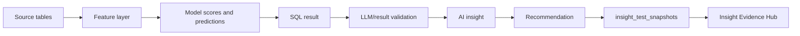

# Insight Evidence Hub

## Purpose

The Insight Evidence Hub answers:

- Why did AI give this answer?
- What data was used?
- What SQL was generated?
- Which model scores were used?
- Which context documents were retrieved?
- What are the limitations?
- Was Gemini or fallback used?
- What is the lineage from data to recommendation?

## Implemented Evidence Paths

| Evidence Path | Status | Evidence |
|---|---:|---|
| Latest AI insight snapshot | Implemented | `GET /debug/latest-insight-evidence` |
| Snapshot table | Implemented | `027_insight_test_snapshots.sql` |
| Snapshot service | Implemented | `insight_snapshot_service.py` |
| Recommendation lineage tables | Implemented | `024_explainability_governance_framework.sql` |
| Recommendation evidence backfill function | Implemented | `create_recommendation_lineage_from_nba` |
| Frontend Evidence Hub tab | Implemented | `InsightEvidenceHubView` in `frontend/app/page.tsx` |
| Broad production lineage for all user actions | Partially implemented | Focus is on AI insight snapshots and NBA evidence. |

## Evidence Hub Sections

| Section | Current Support | Source |
|---|---:|---|
| Recent Insight Runs | Implemented | `insight_test_snapshots` via `fetch_latest_insight_evidence` |
| Related Tables | Implemented | AI response payload and evidence service |
| Related Columns | Implemented | `ai_evidence_utils.py`, AI response payload |
| Semantic Context | Implemented | AI response `related_context` |
| Data Lineage | Implemented | `build_lineage` in `insight_snapshot_service.py` |
| Underlying Models | Implemented | `models_used`, `model_scores`, `model_catalog` where available |
| SQL Evidence | Implemented | `generated_sql`, validation and execution status |
| Related Facts | Implemented | `key_data_points`, result preview |
| Technical Diagnostics | Implemented | latency, provider, fallback flags, technical warnings |

## Lineage Flow

## Recommendation Evidence Architecture

`024_explainability_governance_framework.sql` creates:

- `insight_lineage`
- `recommendation_evidence`
- `model_explanations`
- `context_usage_log`
- `v_recommendation_explainability`
- `create_recommendation_lineage_from_nba`

These tables are not base load tables. They are generated when recommendations are explained or backfilled from `next_best_actions`.

## Client Talking Point

"This is not a black-box AI answer. Every generated insight can show the SQL, tables, columns, model references, context documents, technical diagnostics, and limitations that shaped the answer."

## Current Limitations

| Limitation | Status | Recommendation |
|---|---:|---|
| Some evidence tables may be empty until runtime actions occur | Expected | Run AI questions and lineage backfills before demo. |
| Full user-level audit identity | Not found | Add authenticated user ID and role metadata. |
| Evidence retention policy | Not found | Add lifecycle policy for snapshots and request logs. |
| Model-level explanations | Partially implemented | Persist feature contribution or SHAP explanations into `model_explanations`. |

