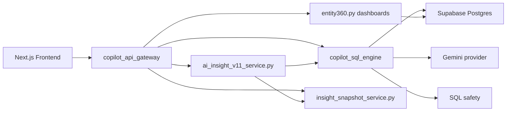

# API And Service Architecture

## Main API Gateway

The main integrated backend is `copilot_api_gateway/api.py`.

| Endpoint | Method | Purpose | Backend Service / Function | Notes |
|---|---|---|---|---|
| `/health` | GET | Service health | Inline route | Implemented |
| `/health/llm` | GET | LLM provider health/config | `health_check` in `copilot_sql_engine/llm_providers.py` | Implemented |
| `/copilot/test-llm` | POST | Test LLM response | `build_llm_provider` | Implemented |
| `/copilot/ask` | POST | General ask endpoint | `run_sql_engine` | Implemented |
| `/intelligence/ask` | POST | Non-copilot alias for ask | `copilot_ask` | Implemented |
| `/intent/classify` | POST | Classify question intent | `classify_intent` | Implemented |
| `/context/search` | POST | Retrieve semantic context | `retrieve_semantic_context` | Implemented |
| `/sql/validate` | POST | Validate generated SQL | `validate_sql` | Implemented |
| `/sql/execute` | POST | Execute validated read-only SQL | `execute_select` | Implemented |
| `/customers/search` | GET | Customer search | `search_customers` | Implemented |
| `/customers/{id}/360` | GET | Customer 360 | `customer_360` | Implemented |
| `/agents/search` | GET | Agent search | `search_agents` | Implemented |
| `/agents/{id}/360` | GET | Agent 360 | `agent_360` | Implemented |
| `/agents/performance-dashboard` | GET | Agent performance dashboard | `agent_performance_dashboard` | Implemented |
| `/campaigns/search` | GET | Campaign search | `search_campaigns` | Implemented |
| `/campaigns/{id}/360` | GET | Campaign 360 | `campaign_360` | Implemented |
| `/policies/lapse-dashboard` | GET | Policy lapse dashboard | `policy_lapse_dashboard` | Implemented |
| `/claims/{id}/360` | GET | Claim 360 | `claim_360` | Implemented |
| `/roles` | GET | Role list | `fetch_roles` | Implemented |
| `/roles/{role}/dashboard` | GET | Role dashboard | `fetch_role_profile` | Implemented |
| `/intelligence/briefing` | GET | Role-aware briefing | `fetch_decision_intelligence` | Implemented |
| `/debug/insight-pipeline` | GET | Debug insight pipeline | Inline route | Implemented |
| `/ai-insight-v11/ask` | POST | AI Intelligence V1.1 ask | `ask_ai_insight_v11` | Implemented |
| `/debug/latest-insight-evidence` | GET | Evidence Hub data | `fetch_latest_insight_evidence` | Implemented |
| `/recommendations/{entity_id}` | GET | Recommendations for entity | `recommendations_for_entity` | Implemented |
| `/lineage/{insight_id}` | GET | Recommendation lineage | SQL over evidence tables | Implemented |

## Supporting Services

| Service | Status | Reference | Purpose |
|---|---:|---|---|
| SQL engine | Implemented | `copilot_sql_engine/` | Generate, validate, execute SQL and produce explainability output. |
| Orchestration service | Implemented as separate service | `copilot_orchestration/` | Intent classification and orchestration plans. |
| Text-to-SQL agent | Implemented as earlier standalone service | `text_to_sql_agent/` | FastAPI text-to-SQL flow. |
| Context retriever | Implemented | `context_retriever_service.py` | Retrieve pgvector context. |
| Embedding pipeline | Implemented | `embed_semantic_documents.py`, `embedding_pipeline/` | Generate and store embeddings. |
| NBA engine | Implemented | `nba_engine/` | Rule-based next-best-action decisioning. |
| Role intelligence service | Implemented | `role_intelligence_service.py` | Role profiles and context. |
| Decision intelligence service | Implemented | `decision_intelligence_service.py` | Role-aware briefing payload. |
| Evidence snapshot service | Implemented | `insight_snapshot_service.py` | Save and retrieve AI evidence snapshots. |
| ML scoring pipeline | Implemented | `ml_scoring_pipeline.py` | Batch model scoring and next action outputs. |

## Service Interaction

## Error Handling Patterns

| Area | Pattern |
|---|---|
| SQL validation | Raises structured validation errors; API returns blocked execution status. |
| SQL execution | Uses statement timeout and read-only execution wrapper. |
| LLM provider | Captures provider metadata, fallback flags, and health checks. |
| Frontend | Most data products fall back to sample data when API unavailable. |
| Evidence | AI snapshot saving is wrapped to avoid breaking the user response. |

## OpenAPI

`export_openapi.py` exists for exporting the API gateway OpenAPI schema.

## Not Found / Recommended

| Capability | Status | Recommendation |
|---|---:|---|
| API authentication | Not found | Add auth before using real data. |
| API rate limiting | Not found | Add for LLM and database protection. |
| Formal service mesh/deployment manifests | Not found | Add Docker/deployment docs for production. |
| Central observability stack | Not found | Add structured logging, metrics, traces. |

